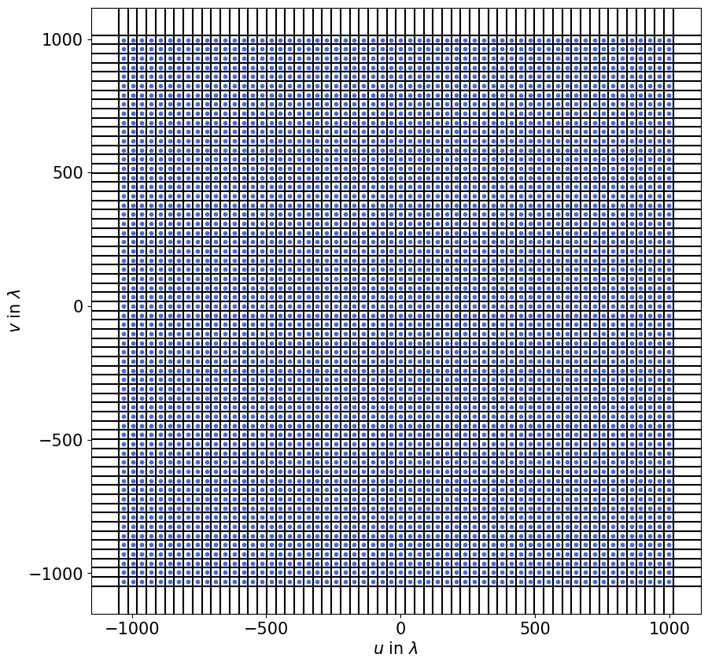

.. _observation:

****************************************************
Observation (:mod:`pyvisgen.simulation.observation`)
****************************************************

.. currentmodule:: pyvisgen.simulation.observation

Observation submodule of pyvisgen.

Simulating an Ideal Radio Interferometer
========================================

The term *ideal* in the context of a Radio Interferometer indicates that this case assumes
a full :math:`(u,v)` coverage for the given resolution.
This method is implemented in the :class:`~pyvisgen.simulation.observation.Observation` class
mainly relying on :py:meth:`~pyvisgen.simulation.Observation.calc_dense_baselines`.
The type of :math:`(u,v)` grid we will be using is named a *dense grid* referring to the :math:`(u,v)` points being
distributed as dense as necessary to obtain an ideal :math:`(u,v)` coverage.

To do and explain this from zero we will follow multiple steps:

1. Creating an Example Image
2. Creating the Ideal :math:`(u,v)` Coverage
3. Simulating the Observation

1. Creating an Example Image
----------------------------

.. code-block:: python

  # essential imports

  import numpy as np
  from scipy.constants import c
  import matplotlib.pyplot as plt

.. image:: ../../_static/resources/ideal_interferometer/model.png
   :width: 65%
   :class: only-light
   :align: center
   :alt: Model Image

.. image:: ../../_static/resources/ideal_interferometer/model_dark.png
   :width: 65%
   :class: only-dark
   :align: center
   :alt: Model Image

|

The above image is the test image in real space we will assume as our real sky flux density distribution.
Additionally we will need the following parameters:

=============== ============== ======= ========= ========================================
Parameter       Variable       Value   Unit      Explanation                             
=============== ============== ======= ========= ========================================
Image Size      ``img_size``   60      pixel     The side length of the test image       
Frequency       ``freq``       230     gigahertz The frequency we observe the source at  
Field Of View   ``fov``        1       arcsec    The Field Of View of the test image     
=============== ============== ======= ========= ========================================

.. code-block:: python

  # define the preset values

  fov = 1
  freq = 230e9
  wavelength = c / freq
 

2. Creating the Ideal :math:`(u,v)` Coverage
--------------------------------------------

The way we want to create the :math:`(u,v)` coverage is, that we want to create exactly one :math:`(u,v)` point in each pixel of the
image in Fourier space. To do this we first have to consider the physical size of one pixel in Fourier space.
We will name this ``delta_uv``, meaning the pixel size in the :math:`(u,v)` space.
This is given by the reciprocal value of the ``fov`` in the unit radians.

.. code-block:: python

  delta_uv = np.deg2rad(fov / 3600) ** (-1)

This ``delta_uv`` is now a manifold of the wavelength.

To create our grid of :math:`(u,v)` points, we will have to create two linear axes: one for :math:`u` and one for :math:`v`.
Since the scale of both is the same, we will only create one and copy it to the other one.
Additionally we want their values to be in the center of their respective pixel. This means that one pair should be exactly at the
Coordinate :math:`(u,v) = (0, 0)`. To achieve this we will also have to choose our binning correctly later on.
Since every pixel should contain one point, we can simply use ``numpy.arange`` to create our :math:`u` and :math:`v` axes:

.. code-block:: python

  uu = (np.arange(
      start=(-img_size / 2) * delta_uv,
      stop=(img_size / 2) * delta_uv,
      step=delta_uv, dtype=np.float128)
      ).astype(np.float64)

  vv = np.copy(uu)

The values are in the range from :math:`\left[-\frac{N_{\text{image}}}{2} \cdot \delta_{uv},\,\frac{N_{\text{image}}}{2} \cdot \delta_{uv}\right]`
where :math:`N_{\text{image}}` is ``img_size`` and :math:`\delta_{uv}` is ``delta_uv``.
This means that there will be zero values for our Fourier space coordinates and we will have as many coordinates as we have pixels.

.. note::

   The grid is created using the data type ``float128`` since the magnitude of the ``delta_uv`` values can differ severly
   depending on the choice of the Field Of View and the size of the image. For small values of the ``fov`` and small images 
   this is not as much of a problem, but for large values the precision of the default ``float64`` data type leads to major instabilites
   and non-linearities which alter the grid and therefore the simulation. The usage of the larger data type ensures that the axes are
   equidistant. This equidistance it preserved when casting the array to ``float64``.

   It is not optional to cast the type back to the 64-bit variant, since the simulation runs using ``pytorch`` which does not support
   the ``float128`` data type.

To picture ourselves where these points will be in the grid our pixels create, we will have to create a binning that creates quadratic bins
with exactly one pixel per bin. These will be used to create the gridded :math:`(u,v)` after we calculated the visiblities.
These bins will have the same width and heigth as our pixels but since we will create the edges of the bins, there will be one value more on each
axis then there are :math:`u` and :math:`v` values.
This can be achieved by adding an offset of half a pixel size (``delta_uv``) in each direction along the axis.

.. code-block::

  bins = (np.arange(
      start=-(img_size / 2 + 1/2) * delta_uv, 
      stop=(img_size / 2 + 1/2) * delta_uv, 
      step=delta_uv, 
      dtype=np.float128))

This positions the bin edges exactly half a ``delta_uv`` left and right of the points so that every 2-dimensional bin contains exactly one point.

These points can now be plotted in the created grid with the following code:

.. code-block::

    fig, ax = plt.subplots(1, 1, figsize=(10, 10))
    for b in bins:
        ax.axvline(x=b, color="black")
        ax.axhline(y=b, color="black")
        
    ax.scatter(uv_grid[0], uv_grid[1], s=10, color="royalblue")
    ax.set_xlabel("$u$ in $\\lambda$")
    ax.set_ylabel("$v$ in $\\lambda$")

.. image:: ../../_static/resources/ideal_interferometer/uv_grid_dark.png
   :width: 100%
   :class: only-dark
   :align: center
   :alt: UV grid

Since this seems to be working, we can now proceed to combine our now generated :math:`(u,v)` coverage and our image.

2. Simulating the Observation
-----------------------------

Reference/API
=============

.. automodapi:: pyvisgen.simulation.observation
    :inherited-members:
