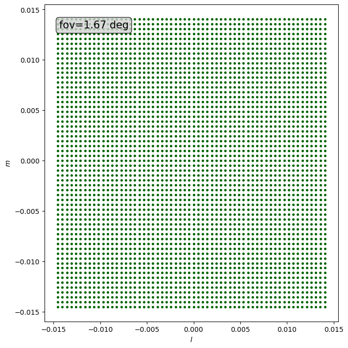

Simulating an Ideal Radio Interferometer
========================================

The term *ideal* in the context of a Radio Interferometer indicates that this case assumes
a full :math:`(u,v)` coverage for the given resolution.
This method is implemented in the :class:`~pyvisgen.simulation.observation.Observation` class
mainly relying on :py:meth:`~pyvisgen.simulation.Observation.calc_dense_baselines`.
The type of :math:`(u,v)` grid we will be using is named a *dense grid* referring to the :math:`(u,v)` points being
distributed as dense as necessary to obtain an ideal :math:`(u,v)` coverage.

To do and explain this from zero we will follow multiple steps:

1. Creating an Example Image
2. Creating the Ideal :math:`(u,v)` Coverage
3. Simulating the Observation

.. note::
   The code shown in this example does not contain the plotting. To view the full code, please visit this
   `Jupyter Notebook <https://github.com/radionets-project/pyvisgen/tree/main/examples/ideal_interferometer.ipynb>`_ in our repository.

1. Creating an Example Image
----------------------------

.. code-block:: python

  # essential imports

  import numpy as np
  from numpy.fft import ifft2, fftshift

  import matplotlib.pyplot as plt
  from matplotlib.colors import LogNorm, CenteredNorm

  from scipy.constants import c
  from scipy.stats import gaussian_kde

  import torch
  from pytorch_finufft.functional import finufft_type1 as nufft2

  import h5py

  device = "cuda:0" # use GPU, change to "cpu" if no GPU available

|

The above image is the test image in real space we will assume as our real sky flux density distribution.
Additionally we will need the following parameters:

=============== ============== ======= ========= ========================================
Parameter       Variable       Value   Unit      Explanation
=============== ============== ======= ========= ========================================
Image Size      ``img_size``   60      pixel     The side length of the test image
Frequency       ``freq``       230     gigahertz The frequency we observe the source at
Field Of View   ``fov``        6000    arcsec    The Field Of View of the test image
=============== ============== ======= ========= ========================================

.. code-block:: python

  # define the preset values and import model image

  img = h5py.File("test_model.h5", "r")["model"][()] # import the test model
  img_size = img.shape[0] # 60
  fov = np.deg2rad(6000 / 3600) # fov / 3600 to convert from asec to deg
  freq = 230e9
  wavelength = c / freq

  delta_uv = fov ** (-1)

2. Creating the Ideal :math:`(u,v)` Coverage
--------------------------------------------

The way we want to create the :math:`(u,v)` coverage is, that we want to create exactly one :math:`(u,v)` point in each pixel of the
image in Fourier space. To do this we first have to consider the physical size of one pixel in Fourier space.
We will name this ``delta_uv``, meaning the pixel size in the :math:`(u,v)` space.
This is given by the reciprocal value of the ``fov`` in the unit radians.

.. code-block:: python

  delta_uv = np.deg2rad(fov / 3600) ** (-1) # fov / 3600 to convert from asec to deg

This ``delta_uv`` is now a manifold of the wavelength.

To create our grid of :math:`(u,v)` points, we will have to create two linear axes: one for :math:`u` and one for :math:`v`.
Since the scale of both is the same, we will only create one and copy it to the other one.
Additionally we want their values to be in the center of their respective pixel. This means that one pair should be exactly at the
Coordinate :math:`(u,v) = (0, 0)`. To achieve this we will also have to choose our binning correctly later on.
Since every pixel should contain one point, we can simply use ``numpy.arange`` to create our :math:`u` and :math:`v` axes.
Of these we then can create a 2-dimensional grid using ``numpy.meshgrid``.

.. code-block:: python

  uu = (np.arange(
      start=(-img_size / 2) * delta_uv,
      stop=(img_size / 2) * delta_uv,
      step=delta_uv, dtype=np.float128)
      ).astype(np.float64)

  vv = np.copy(uu)

  uv_grid = np.meshgrid(uu, vv)

The values are in the range from :math:`\left[-\frac{N_{\text{image}}}{2} \cdot \delta_{uv},\,\frac{N_{\text{image}}}{2} \cdot \delta_{uv}\right]`
where :math:`N_{\text{image}}` is ``img_size`` and :math:`\delta_{uv}` is ``delta_uv``.
This means that there will be zero values for our Fourier space coordinates and we will have as many coordinates as we have pixels.

.. note::

   The grid is created using the data type ``float128`` since the magnitude of the ``delta_uv`` values can differ severly
   depending on the choice of the Field Of View and the size of the image. For small values of the ``fov`` and small images
   this is not as much of a problem, but for large values the precision of the default ``float64`` data type leads to major instabilites
   and non-linearities which alter the grid and therefore the simulation. The usage of the larger data type ensures that the axes are
   equidistant. This equidistance it preserved when casting the array to ``float64``.

   It is not optional to cast the type back to the 64-bit variant, since the simulation runs using ``pytorch`` which does not support
   the ``float128`` data type.

To picture ourselves where these points will be in the grid our pixels create, we will have to create a binning that creates quadratic bins
with exactly one pixel per bin. These will be used to create the gridded :math:`(u,v)` after we calculated the visiblities.
These bins will have the same width and heigth as our pixels but since we will create the edges of the bins, there will be one value more on each
axis then there are :math:`u` and :math:`v` values.
This can be achieved by adding an offset of half a pixel size (``delta_uv``) in each direction along the axis.

.. code-block:: python

  bins = (np.arange(
      start=-(img_size / 2 + 1/2) * delta_uv,
      stop=(img_size / 2 + 1/2) * delta_uv,
      step=delta_uv,
      dtype=np.float128))

This positions the bin edges exactly half a ``delta_uv`` left and right of the points so that every 2-dimensional bin contains exactly one point.

These points can now be plotted in the created grid with the following code:

.. code-block:: python

    fig, ax = plt.subplots(1, 1, figsize=(10, 10))
    for b in bins:
        ax.axvline(x=b, color="black")
        ax.axhline(y=b, color="black")

    ax.scatter(uv_grid[0], uv_grid[1], s=10, color="royalblue")
    ax.set_xlabel("$u$ in $\\lambda$")
    ax.set_ylabel("$v$ in $\\lambda$")

.. image:: ../../_static/resources/ideal_interferometer/uv_grid.png
   :width: 100%
   :class: only-light
   :align: center
   :alt: UV grid

Since this seems to be working, we can now proceed to combine our now generated :math:`(u,v)` coverage and our image.

3. Simulating the Observation
-----------------------------

The next step is to calculate the visiblities our interferometer measures. To do this we need to use the *RIME formalism* as described by [SMIRN2011]_,
which uses a Jones formalism to model the path of the radio signal using a sum of matrix multiplications.
The full-sky RIME is given by the following fomula:

.. math::

  V_{pq}(u_{pq}, v_{pq}) = \int_l\int_m \mathrm{\overline{E}}_p(l, m)\mathrm{K}_p(l, m)
  \mathrm{B}(l, m)
  \mathrm{K}_q^\dagger(l, m)\mathrm{\overline{E}}_q^\dagger(l, m)
  \frac{\symup{d}m\;\symup{d}l}{n}

The 2-dimensional intensity distribution of the observed source, in our case our test image, is described by the :math:`\mathrm{B}` matrix.
We integrate over the direction cosines :math:`l` and :math:`m`, which describe the position of the source on the tangential plane projection of our sky.
Since the telescopes :math:`p` and :math:`q` are at seperate positions, the signal arrives with a geometrically based time delay between them.
This creates a phase delay between the received signals. This is described by the :math:`\mathrm{K}_{p, q}`, which are combined by multiplication to form the
:math:`\mathrm{K_{pq}}` matrix, which takes the form

.. math::

   K_{pq} = \exp\left[-2\pi i\left( u_{pq} l + v_{pq} m + w_{pq}\left(\sqrt{1 - l^2 - m^2} - 1\right)\right)\right]

There our :math:`u` and :math:`v` coordinates are used to describe the positions of the telescopes normalized to the wavelength of our signal wave.
The :math:`\mathrm{\overline{E}}` matrix describes the direction dependent effects of the telescope response.
It is convention to define the :math:`w_{pq}` dependent part of the :math:`\mathrm{K}` matrix and the :math:`1/n` into the :math:`\mathrm{\overline{E}}` matrix
which then becomes the :math:`\mathrm{\overline{E}}` matrix.
Since we are looking at a perfect interferometer, we assume that we can neglect direction dependent effects which means that :math:`\mathrm{E} = \mathbb{1}`.

This means that our needed equation to describe the visiblities of a pair of telescopes :math:`pq` looks like this:

.. math::

  \mathrm{V}_{pq}(u_{pq},v_{pq}) = \int_l\int_m \mathrm{B}(l,m)
  \exp\left( -2\pi i \left( u_{pq}l + v_{pq}m \right)\right)
  \symup{d}m\;\symup{d}l

This is nothing less but the 2-dimensional Fourier transform of our model intensity distribution. Since we are in a discrete case, since our distribution is
divided into pixels, the integral transitions to a discrete sum over the :math:`(l, m)` coordinates of each pixel.

What's special about this Fourier transform is, that the real space coordinates are *not equidistant*. This is a problem if one is using a typical
Fast Fourier Transform (FFT) algorithm like ``numpy.fft.fft`` since these assume a homogenous real space.
For this reason we will have to use a *Nonuniform Fast Fourier Transform* (NUFFT) like the python implementation
FINUFFT_ by the Flatiron Institute [BARN2019]_.

In this the following formula is used to calculate the 2-dimensional Fourier transform for nonuniform coordinates:

.. math::

  f_{kl} = \sum_{i, j=1}^M c_{ij} e^{i (kx_j + ly_i)}~, \qquad \mbox{ for } \; k, l\in\mathbb{Z}, \quad -N/2 \le k,l \le N/2-1 ~.

If we look at their coefficients, we can see, that we will need to modify our :math:`(l, m)` coordinates, since
they are the :math:`x` parameters in this transform. Because the formula assumes the Fourier space coordinates :math:`(k, l)` to
be whole numbers, we will need to put their scaling (the scaling of :math:`(u, v)`) into our :math:`(l, m)` coordinates as well.
The formula also assumes the real space coordinates to be a manifold of :math:`2\pi`, which means this we will have to move into our
coordinates as well.

All in all we end up with the substitution:

.. math::
   (x_i, y_j) = (l, m) \to \frac{2\pi}{\Theta}(l, m),

with :math:`\Theta` being the Field of View.
Since the calculations of ``pyvisgen`` are done using ``pytorch`` to enable GPU-based calculations, we will use the FINUFFT wrapper
`pytorch-finufft`_.

To perform this calculation in our code, we will first need to create the values of :math:`(l, m)`. These are the direction cosines of
a uniform grid in an equatorial coordinate system with coordinates RA (Right Ascension) and DEC (Declination). This grid will be called
``rd_grid``. The code to calculate this grid is taken from :py:meth:`~pyvisgen.simulation.Observation.create_rd_grid` and
:py:meth:`~pyvisgen.simulation.Observation.create_lm_grid`.

.. code-block:: python

  def create_rd_grid(fov, img_size, dec):
    res = fov / img_size
    r = torch.from_numpy(
        np.arange(
            start=-(img_size / 2) * res,
            stop=(img_size / 2) * res,
            step=res,
            dtype=np.float128,
        ).astype(np.float64)
    ).to(device)
    d = r + dec

    R, _ = torch.meshgrid((r, r), indexing="ij")
    _, D = torch.meshgrid((d, d), indexing="ij")
    rd_grid = torch.cat([R[..., None], D[..., None]], dim=2)

    return rd_grid

  def create_lm_grid(fov, img_size, dec):

    dec = np.deg2rad(dec).astype(np.float128)

    rd = create_rd_grid(fov=fov,
                        img_size=img_size,
                        dec=dec).cpu().numpy().astype(np.float128)

    lm_grid = np.zeros(rd.shape, dtype=np.float128)
    lm_grid[..., 0] = np.cos(rd[..., 1]) * np.sin(rd[..., 0])
    lm_grid[..., 1] = np.sin(rd[..., 1]) * np.cos(dec) - np.cos(
        rd[..., 1]
    ) * np.sin(dec) * np.cos(rd[..., 0])

    return torch.from_numpy(lm_grid.astype(np.float64)).to(device)

We will assume that the center of our model is located at the declination :math:`0\;\symup{deg}`.

To demonstrate the effect of the non-equidistant :math:`(l, m)` points, we will first look at a much larger
section of the sky with a FoV of :math:`90\;\symup{deg}`.

.. code-block:: python

    test_grid = create_lm_grid(fov=np.deg2rad(90), img_size=img_size, dec=0)

The created :math:`(l, m)` grid is shown in the figure below.

We can clearly see that the grid is not homogenous on the :math:`l` and the
:math:`m` axes. This effect is existent but less impactful in case of a small FoV.

The correct grid with our Field of View is calculated and plotted below:

.. code-block:: python

    lm_grid = create_lm_grid(fov=fov, img_size=img_size, dec=0)

    l = lm_grid[..., 0, 0].cpu().numpy()
    m = lm_grid[..., 1, 0].cpu().numpy()

Now that we have our :math:`(l, m)` grid set up, we can continue to calculate the nonuniform Fourier transform:

.. code-block:: python

    x = 2 * torch.pi * lm_grid[..., 0].flatten() / fov
    y = 2 * torch.pi * lm_grid[..., 1].flatten() / fov

    img_flat = torch.tensor(img, dtype=torch.complex128)
    img_flat = img_flat.to(device).flatten() # send to GPU and transform image to vector

    stokes_i = nufft2(points=torch.vstack([x, y]),
                      values=img_flat,
                      output_shape=(img_size, img_size),
                      isign=-1,
                      eps=1e-15).cpu().numpy() # compute nonuniform FFT

We will call our Fourier transformed image ``stokes_i`` since it is the :math:`I` component
of the Stokes matrix of the source distribution.

Since we have a perfect grid, we would be able to just plot our results straight away,
but since we want to check, if our :math:`(u, v)` grid was created correctly, we will proceed
to perform the regular gridding process, we would also use, if the :math:`(u, v)` coordinates were
generated by a measurement.

The gridding works analogously to that in the :class:`~pyvisgen.Gridding` module. In short, it matches
of :math:`(u, v)` coordinates and corresponding visibility values to create the ``samps``. The :math:`(u, v)` coordinates
are then assigned to the same 2d grid, we created earlier by creating a 2-dimensional histogram with the ``stokes_i`` values
as weights (real and imaginary parts of the visiblities are put in individual histograms).

.. code-block:: python

    real = stokes_i.real.T
    imag = stokes_i.imag.T

    samps = np.array(
        [
            np.append(-uv_grid[0].ravel(), uv_grid[0].ravel()),
            np.append(-uv_grid[1].ravel(), uv_grid[1].ravel()),
            np.append(real.ravel(), real.ravel()),
            np.append(-imag.ravel(), imag.ravel()),
        ]
    )

    mask, *_ = np.histogram2d(samps[0], samps[1], bins=[bins, bins], density=False)
    mask[mask == 0] = 1

    mask_real, x_edges, y_edges = np.histogram2d(
        samps[0], samps[1], bins=[bins, bins], weights=samps[2], density=False
    )
    mask_imag, x_edges, y_edges = np.histogram2d(
        samps[0], samps[1], bins=[bins, bins], weights=samps[3], density=False
    )
    mask_real /= mask
    mask_imag /= mask

    dirty_img = np.abs(fftshift(ifft2(fftshift(mask_real + 1j * mask_imag))))

These histograms with the real and imaginary parts of the visibilities can then be plotted in a regular image. Since
we are obviously dealing with complex numbers, we will have to split the visibility masks in either real and imaginary
or in this case in amplitude and phase according to Eulers formula:

.. math::

   c = a\cdot \exp(i\varphi),\;\; c \in \mathbb{C}.

The two resulting components are shown below.

Finally we can look at our resulting "dirty" image. Since we have a perfect :math:`(u, v)` coverage, we can hardly call this
"dirty" but it was created just like an image with incomplete coverage. Additionally to the dirty image, we can also calculate the
difference between the dirty image and the model.

We can clearly see, that the :math:`(l, m)` grid, that was assumed as the real space coordinates, caused a distortion.
This distortion depends on the physical size of the part of the sky we are looking at. The distrotion of the coordinates
becomes much more visible, meaning the difference becomes greater, the larger we make the Field of View of our image.
Since we used an FoV of :math:`6000\;\symup{asec}`, we can clearly see the distortion in a significant intensity,
while an image with smaller FoV won't be affected as much by the effect.

The below image is simulated with an FoV of :math:`1\;\symup{asec}` and the difference between dirty image and model
is only visible in a magintude of :math:`10^{-12}`, which is way below a realistically achievable sensitivity of a real measurement.

References
----------

.. [SMIRN2011] O. M. Smirnov. *Revisiting the radio interferometer measurement equation: I. A full-
   sky Jones formalism*. A&A 527, 2011. DOI: `10.1051/0004-6361/201016082`_

.. [BARN2019] A. Barnett, J. Magland and L. Klinteberg. *A parallel nonuniform fast Fourier transform library based
   on an "exponential of semicircle" kernel*. SIAM Journal on Scientific Computing 41, 2019. DOI: `10.1137/18M120885X`_

.. _10.1051/0004-6361/201016082: http://dx.doi.org/10.1051/0004-6361/201016082

.. _10.1137/18M120885X: https://doi.org/10.1137/18M120885X

.. _FINUFFT: https://finufft.readthedocs.io/en/latest/index.html

.. _pytorch-finufft: https://flatironinstitute.github.io/pytorch-finufft/index.html
